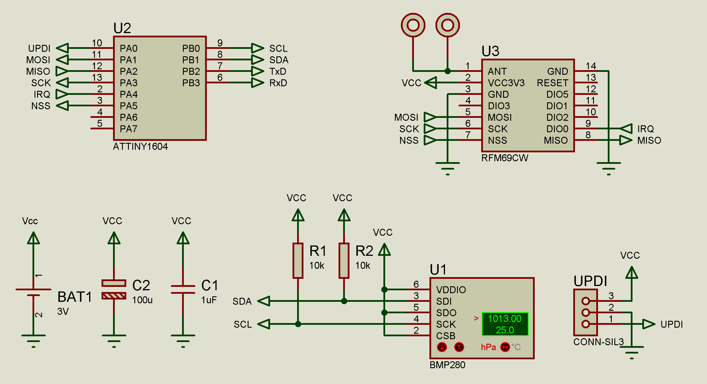
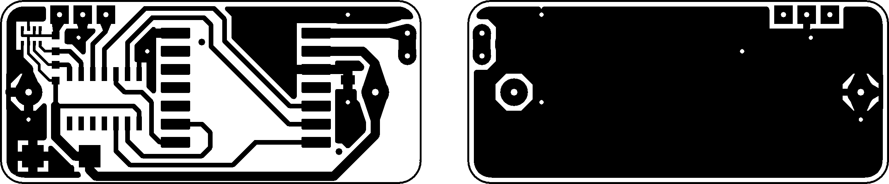
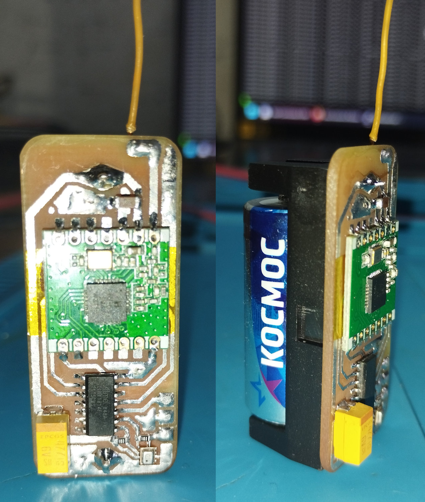

# RFMSensor: Low-Power Wireless Temperature and Pressure Sensor

## Overview

RFMSensor is a compact, battery-powered sensor designed for smart home applications. It measures temperature and atmospheric pressure using the BMP280 sensor, communicates wirelessly via the **RFM69** module, and integrates seamlessly with Home Assistant through MQTT discovery. The device runs on an **ATtiny1614** microcontroller and is powered by a single CR123 battery.

The sensor sends periodic updates (temperature, pressure, battery voltage, and battery level) to an MQTT broker via a compatible RFM69 gateway. It features ultra-low power consumption for long battery life, with configurable settings stored in EEPROM.

The PCB is designed to be small (46mm x 20mm) while remaining feasible for home fabrication.

## Features

- **Sensors**: BMP280 for temperature (±0.5°C accuracy) and pressure (±1 hPa accuracy).
- **Wireless Communication**: RFM69CW/SX1231 (433/868/915 MHz) for reliable long-range low-power communication.
- **Battery Monitoring**: Measures battery voltage using the ATtiny1614's internal bandgap reference and calculates battery percentage.
- **MQTT Integration**: Publishes data to MQTT topics and supports Home Assistant auto-discovery.
- **Low Power Design**: Sleeps in power-down mode, waking via RTC PIT. Update interval: every 5 minutes; device identification: every 12 hours; startup delay: 3 minutes.
- **Configurable Settings**: EEPROM stores device ID, bandgap voltage (for accurate battery readings), and other parameters. Defaults are applied on first boot.
- **Unique ID Generation**: Automatically generates a 6-character hexadecimal ID unique device ID (djb2 hash from serial number) if not preset.
- **Compact Size**: 46mm x 20mm PCB.

## Hardware Components

- **ATtiny1614** microcontroller
- BMP280 pressure/temperature sensor (I2C address: 0x77)
- RFM69 wireless module
- CR123 battery holder
- Miscellaneous passives (resistors, capacitors) as per schematic

## Schematic and PCB

- **Schematic**: 
- **PCB Layout** (600 DPI): 

## Assembled Device Photo



## Setup and Installation

### Firmware Compilation and Flashing

1. Use VS Code or PlatformIO.
2. Open the project and compile the firmware.
3. Flash the compiled HEX file to the ATtiny1614 using an UPDI programmer (recommended: Serial UPDI or pyupdi).

### Fuse Configuration

PlatformIO automatically calculates and sets the necessary fuses based on the settings in `platformio.ini`.

**To burn/set the fuses:**

- In **PlatformIO sidebar** → **Project Tasks** → **release** → **Platform** → "Set Fuses" option in the menu

**Or via terminal command:**
```bash
pio run -t fuses
```

## Usage

1. Assemble the hardware as per the schematic and PCB.
2. Flash firmware and fuses.
3. Optionally, flash custom EEPROM settings.
4. Insert CR123 battery.
5. The device will start measuring and transmitting after the initial delay.
6. Ensure the gateway is running and connected to your MQTT broker.

Battery life depends on update frequency and transmit power; expect months of operation on a single CR123.

## Dependencies

- BMP280 library (included in source)
- RF24 library (included in source)
- Compatible NRF24/RFM69 MQTT gateway: [MQTTRFGateway](https://github.com/Tsukihime/MQTTRFGateway)

## License

This project is open-source under the MIT License. See LICENSE file for details.
